  

# Welcome to Pita!

# Ever wanted to run an app like a pro but for (nearly) free?

Disclaimer: Screenshots of free tiers are taken in August 2024. Check for changes before deploying. Author of this repo is not responsible for any costs occurring through using any of the material in this repo. The document solely describes the author’s experience with free cloud offerings.

Why the name Pita? That’s a longer discussion. For now just so much: I love sourdough, and the fact I recently migrated this app from node ton bun has nothing to do with it. 

Anyway, over the last past years I gained quite a bit of experience with architecting, developing, running and managing lightly used applications basically for free. By "lightly used" I'm referring to the amount of work like transactions or HTTP requests they serve and by "free" I mean for a handful of cents per day max. While the applications are not used heavily they don't want to compromise on professionalism. They deserve proper ci/cd, observability and most importantly high availability and resilience. 

Nowadays it all starts with data, right? So we can't compromise on our data-layer. Therefor I choose CockroachDB and luckily there is a free tier available: https://cockroachlabs.cloud/signup 
As you can see: No credit card required and for zero dollars you can roughly execute 10 SQL queries/s 24 by 7. Great! Love it. Way more than most of my light apps need and the distributed nature of CockroachDB guarantees the high-availability and resilience of my data layer. Also pretty cool to have a RDBMS always available with a SQL-shell ready waiting for you if you quickly want to test a query! Data-layer? Solved.

---

  

---

Let's continue with our shopping list:  
- Developer tooling & IDE: Google Cloud Shell  
- Repo: Github  
- Observability: Grafana Cloud for metrics, logs & traces  
- Synthetic monitoring: Grafana Cloud  
- CI/CD: Google Cloud Build  
- Authentication: Sign In With Google, CockroachDB as backend  
- Runtime: Google Cloud Run   
- Database: Clockroach Cloud Free Tier

---

So what we get for free looks like the following:  


You might wonder about the programming language we are going to use: I mostly use Node but we will eventually run a docker container so what I describe is applicable as long as it runs in docker.

As we need to have an example app this repo contains an enhanced “Hello Web” application called Pita. Users can sign in (with Google) and if they are authorized can add notes to a single page. Notes are persisted in the database and retrieved from there. A pretty vanilla web-app. 

I'm biased and choose Google and Grafana because of my personal experience but I think other parents have nice children too: AWS Fargate, Azure Containers, etc. But you want to check if the service you use is part of a free tier. Cloud Run and Build are both part of Google's free tier (2 mio requests per month, 120 build-minutes per day). Grafana Cloud gives me 10k metrics, 50GB of logs & traces. Clearly Cloud Run has o11y built-in and so Grafana isn't strictly needed but I do prefer it over Google's o11y especially because of the way I can combine data from different sources like GCP and my CockroachDB instance. Now as of this writing the free tier of Cockroach Cloud does not export prometheus metrics or logs therefor I instrumented my app in a way that it exposes the most important database metrics by itself: SQL executions, commits, response times and so on. I cases when I experience a database degredation I would need to open the Cockroach Cloud console and investigate. So far this wasn't needed but it's good to know I could if I needed to. The application meassures sql query repsonse times and creates its own prometheus metrics from them. The Grafana agent collects them and sends them to the Grafana Cloud. Therefore the sql metrics I use in my dashboard only cover what the application sees. If you execute other queries (e.g. in a shell) they will not show up.

---

   

---


---

Make sure you pick regions (especially for your app and you CockroachDB instance close to each other so you minimize network latencies). This is how it looks for me:
       

---

After setting up your database, create a new Cloud Run service (you might be asked to enable some APIs if you haven't done so before).


---

Also make sure you pick a CO2 friendly region. 
      

---

You might wonder why Google Cloud shell? I just love it. A (8GB) VM with most developer tools always waiting for you. You can even run a minikube cluster in it. Would love to see a Cockroachdb pre-installed though. But given CockroachDB is a single binary it’s a trivial download & installation should I need a local one. Having said that, I use the cloud version most of the time anyway. Back to Google Cloud Shell: By using it for this exercise all we need is a browser. Cloud shell requires you to have a free Google Mail account though.  

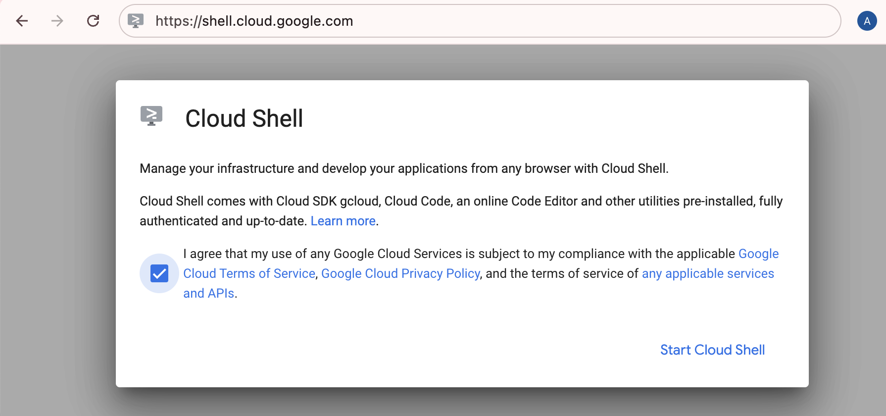

---

Selfie of me hacking the day away in Google's Cloud shell's editor, ready to commit and to trigger the ci/cd pipeline we are going to create.

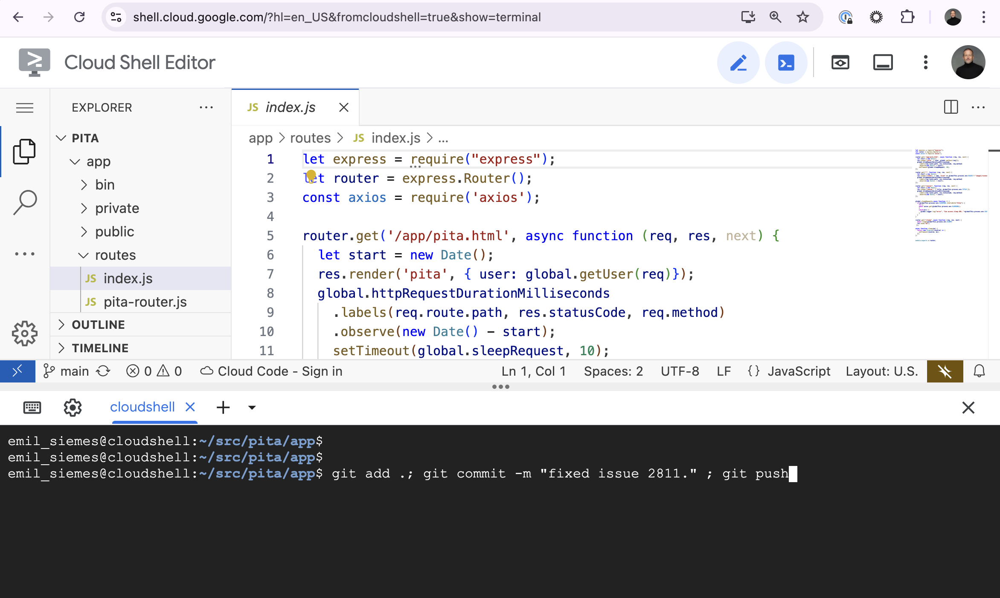

---

Should you sign-up to Google Cloud just now, be advised that your clock for the 3 month credits is ticking. The setup outlined here should not tap into the credits so use them for other experiments!

Advice: Setup a budget and budget alerts! This is available under “Billing” in the GCP console. 

After signing up to all the services required and if you are ready to roll, fire up your IDE or cloud shell and start building your app and a Dockerfile for it. Commit it to github. 

Talking about Docker: I know it’s not the purist’s vision but for our purposes we need to actually run more than one process in the container:

1. Your app  
2. The Grafana agent (now known under the name Alloy)  
3. Nginx

The app is obvious, the Grafana agent for convenience. You could alternatively build your app in a way that it is directly sending metrics, logs & tracing to Grafana cloud but I prefer to keep things separated. Why Nginx?  Well Cloud Run injects it’s own tracing headers in to the HTTP headers and this confuses Grafana Tempo so we need a way to get rid of them and Nginx is doing this for us (excerpt from nginx.conf):  
   ```
   upstream app {
        ip_hash;
        server 127.0.0.1:3333;
    }

   server {  
       listen 0.0.0.0:3000;  
       proxy_set_header x-cloud-trace-context "";  
       proxy_set_header grpc-trace-bin "";  
       proxy_set_header traceparent "";  
   ```

My Dockerfile basically looks like this:  
   ```  
FROM oven/bun:latest

RUN apt-get update -y
RUN apt-get install --yes nginx curl unzip

WORKDIR /opt/app

RUN curl -LJO https://github.com/grafana/agent/releases/download/v0.39.0-rc.0/grafana-agent-linux-amd64.zip  
RUN unzip grafana-agent-linux-amd64.zip  
RUN chmod +x grafana-agent-linux-amd64.zip

COPY app.js /opt/app  
# Omitted: Copy rest of app  
COPY nginx.conf /etc/nginx/nginx.conf  
COPY grafana-agent-config.yaml /opt/app

RUN chmod +x /opt/app/start.sh

RUN cd /opt/app; bun install

ENTRYPOINT /opt/app/start.sh
   ```  
---

And then the above references start.sh script looks like this:  
   ```  
cd /opt/app  
/usr/sbin/nginx

/opt/app/grafana-agent-linux-amd64  -config.expand-env -enable-features integrations-next --config.file /opt/app/grafana-agent-config.yaml >$LOGFOLDER/grafana.log 2>&1 & $LOGFOLDER/grafana.log 2>&1 &

bun run --preload @opentelemetry/auto-instrumentations-node/register ./bin/www.js
   ```  
---

The script starts nginx using our configuration which Docker copied to /etc/nginx/nginx.conf and then starts the Grafana agent before finally starting our application with the open telemetry auto-instrumentation. Should you use something else than node the start of your application obviously looks different. Talking about Grafana don't forget to create a Postgres datasource and connect it to your CockroachDB instance so you can enhance your metric dashboards with content from your database. In my case the number of pitas which I don't have as a metric but a Select count(*) from Pita does the trick obviously.

Now what makes Cloud Run run so efficiently that it can be offered by Google for free (within it’s limits) is the fact that it scales down to zero when not used. No request being worked on by the app, no CPU. This makes things a bit tough with our Grafana agent which should collect metrics every 15s because it might not be on CPU. Therefore I do a bit of a trick in my app: Whenever I’m done handling a request the application starts another request asynchronously which just sleeps for a bit. 4s in my case which normally gives the Grafana agent enough CPU to collect metrics at least once after each request. See the middleware I use below. Neat trick, isn’t it? Which also means no request at all: No metrics either. One option is set up a synthetic transaction in Grafana Cloud to access our app once per metrics collection interval. Which should result in metrics being collected 24 by 7. Clearly this could incure cost therefor I rather perfer having no metrics in phases with no activity. That's also the reason why in my Grafana dashboards I don't use the rate of metrics but the pure value. For light use applications prometheus' rate function provide to much insight if you ask me. I
```  
   let sleepinprogress = false;
   app.use(
    async function (req, res, next) {
      if (globalThis.process.env.SLEEPURL.startsWith("http") && !sleepinprogress && req.url != '/sleep') {
        sleepinprogress= true;
        try {
          axios.get(globalThis.process.env.SLEEPURL);
        }
        catch (err) {
          global.logger.log("error", "Can't access sleep URL: " + globalThis.process.env.SLEEPURL + " " + err);
        }
      }
    next();
  });

  async function sleep(ms) {
    return new Promise((resolve) => {
      setTimeout(resolve, ms);
    });
  };

  let index = require('./routes/index.js');

  index.get('/sleep', async (req, res, next) => {
    await sleep(globalThis.process.env.SLEEP);
    sleepinprogress = false;
    global.logger.log("info", "Woke up.");
    res.send("ok");
  });
```

---

When you define your service in Cloud run you will be asked to provide Google Cloud with access to your repo:
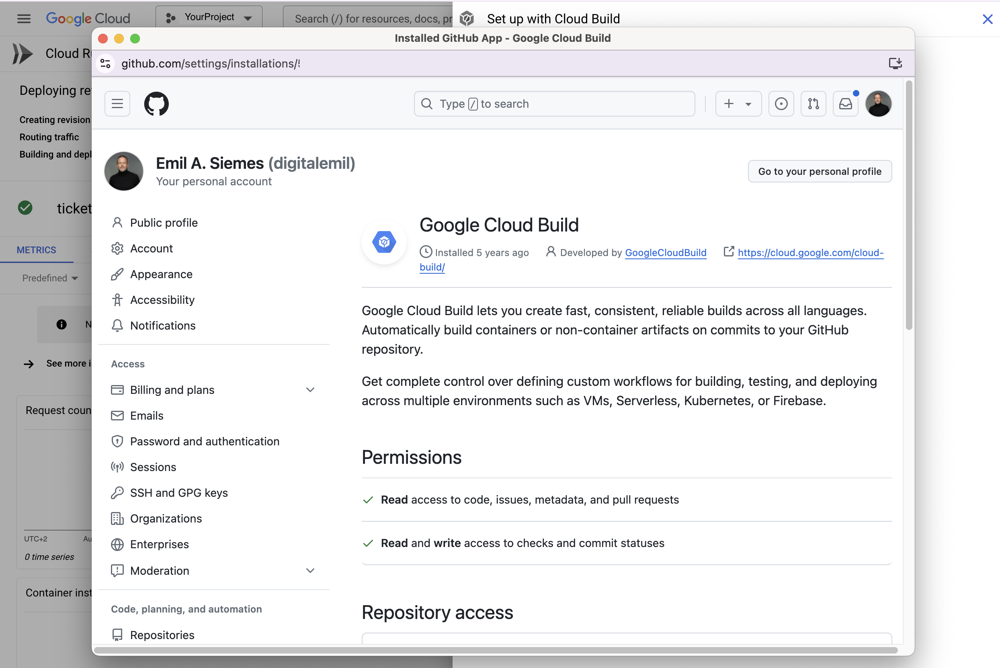

---

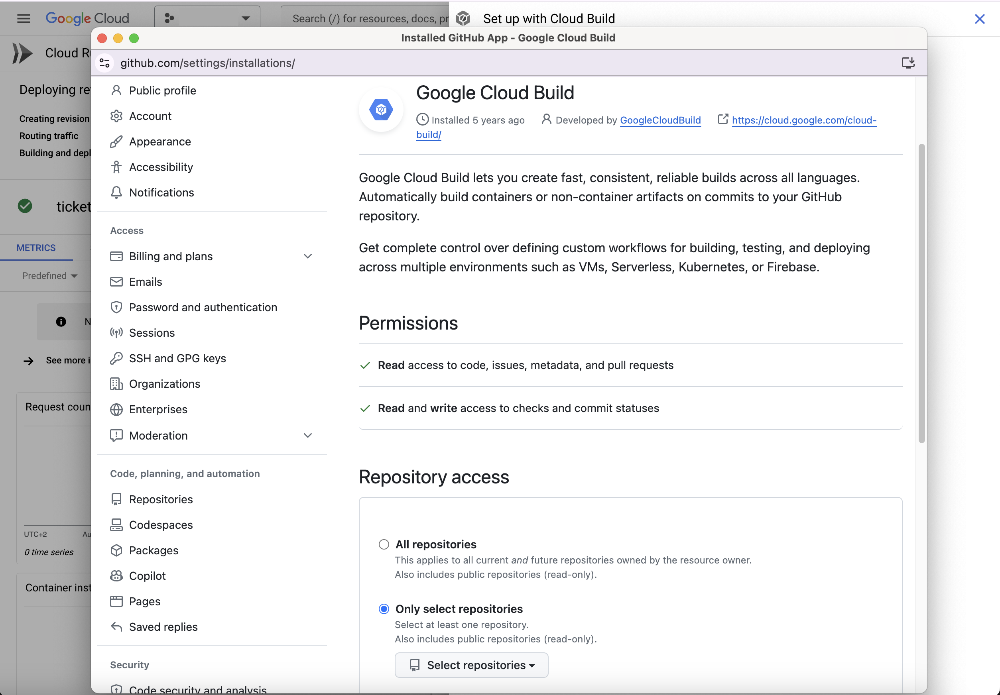

---

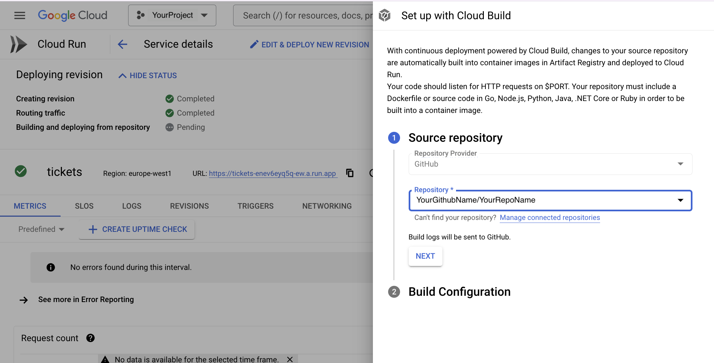

---

Watch out for the following:
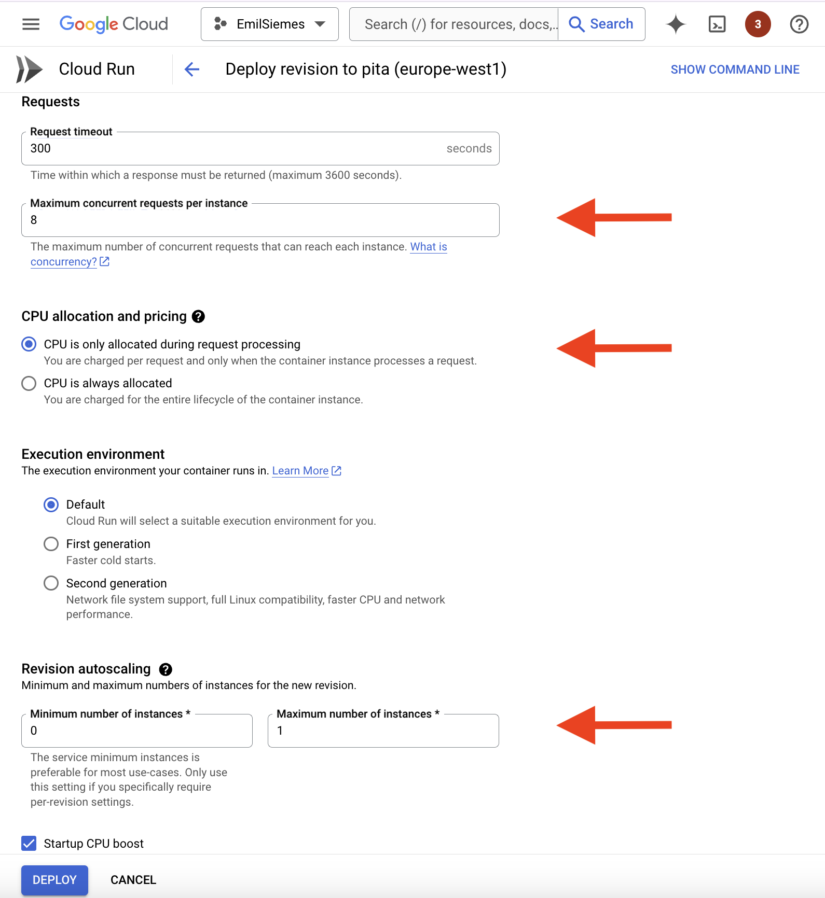
- Maximum concurrent requests per instance 8 (any low number will prevent from high costs in case of a DOS attack)
- CPU only allocated during request processing
- Maximum number of instances 1

---

Define your environment variables:
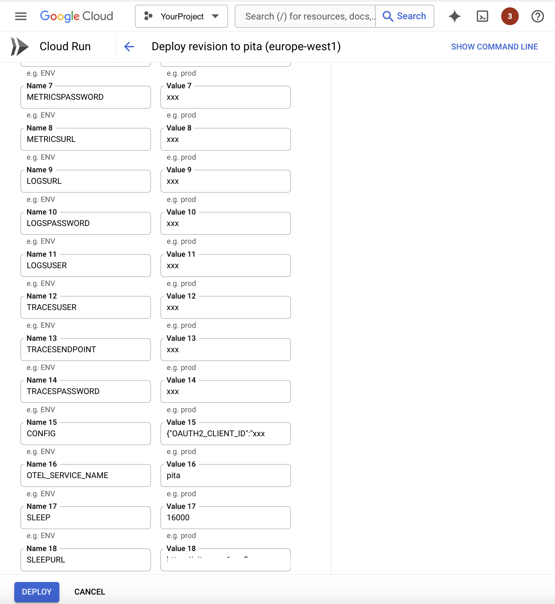
I personally would prefer to store tokens and passwords as secrets but then we leave the free tier of Google Cloud so I stick with environment variables.

Before I forget: If you also would like to use Sign In with Google you need a consent screen and oauth client. Please see Google's docs on this. Here are some screenshots to guide you along:
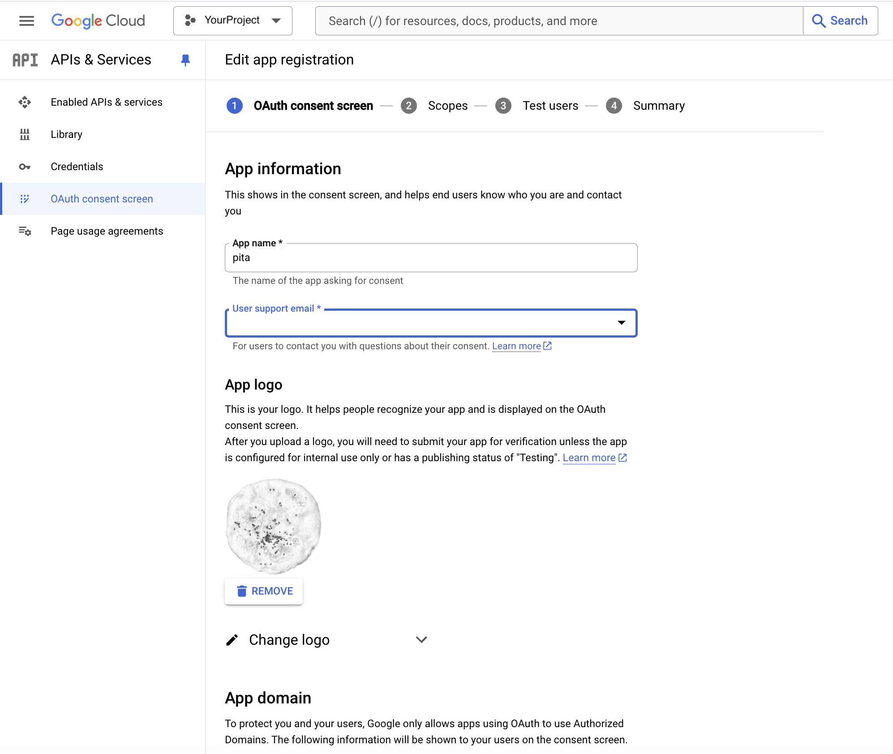

---

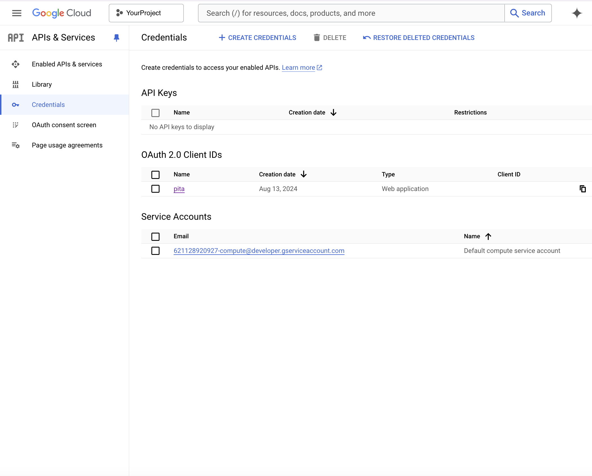

---

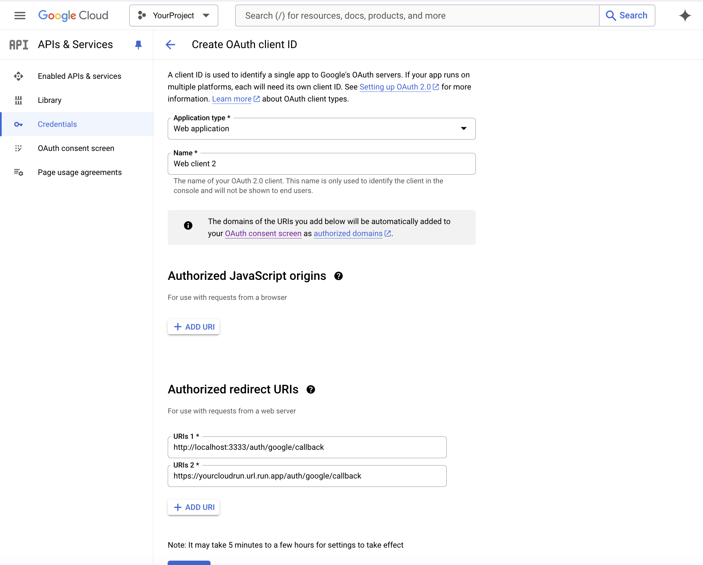

---

Eventually you will need a CONFIG environment variable looking similar to this:
   ``` 
CONFIG='{"OAUTH2_CLIENT_ID":"xyz.apps.googleusercontent.com","OAUTH2_CLIENT_SECRET":"GOABCDEF","OAUTH2_CALLBACK": "https://yourURL:3000/auth/google/callback"}'
   ``` 

---

After you deployed a new version it might take nginx a minute or so to figure out the app is running so don't get worried if you see 502 the first time you hit your app:

Shortly after you will be served a pita:
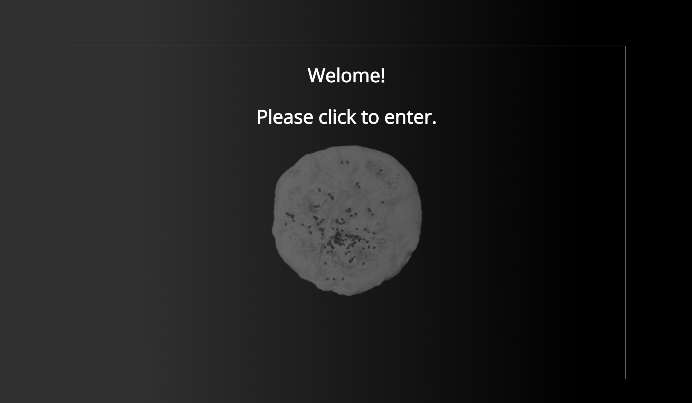

---

A way to at least reduce the 502 error messages is to point Cloud Run's startup and liveness probe the app itself not the nginx instance in front of it. In my case nginx listens on port 3000, but the app on 3333, therefore the probes look like this:
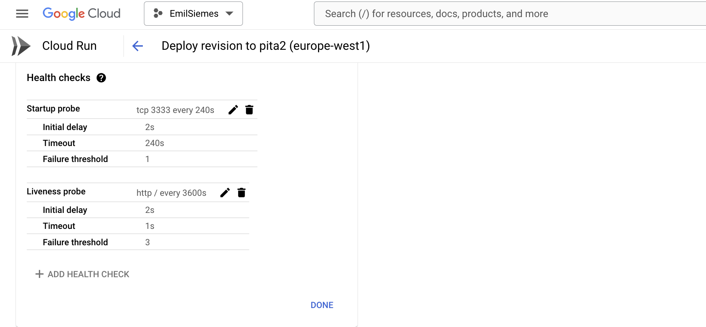

---

What about a custom domain? The domains and paths created by Cloud Run are hard to remember so we want to link our service to a real domain name. There was a cost neutral way available in Cloud Run but unfortunately that's gone. Now there are integrations in Cloud Run and one is called "Custom domains" which would achieve what we need but it creates a loadbalancer and a static ip and roughly costs a dollar a day. Instead what I am doing is adding a DNS forwarding rule within my DNS/WebSite settings at Squarespace. Basically I tell DNS to forward all requests to subdomain.mydomain.com to the Cloud Run URL. So my Cloud Run serice is reachable under the domain I want for free. Downside: After hitting subdomain.mydomain.com in your browser the URL will be back to the Clour Run provided one: ...a.run.app which is acceptable for me at least.

---

And finally some advice: Watch your metrics in Google Cloud:
This is screenshot from a Cloud Run service which I unfortunately had runnung with: "CPU is always allocted":
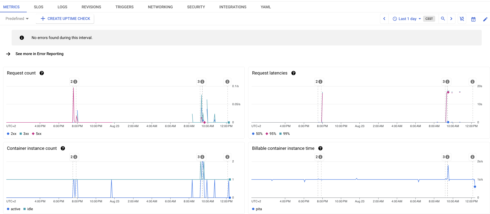
In contrast, this is how it should like (Billable container instance time 0)
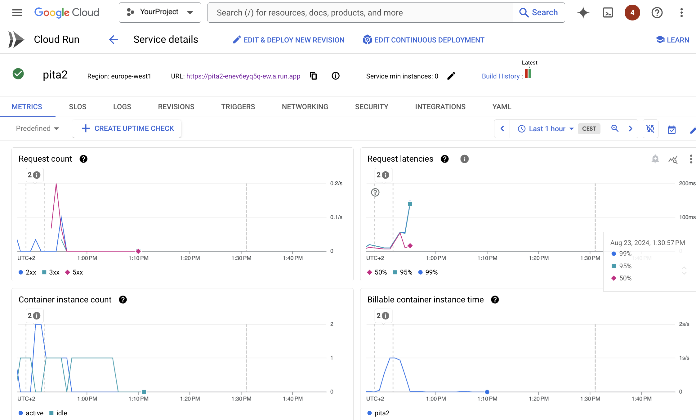

---

Here's a screenshot of how a dashboard with metrics, logs, traces and CockroachDB data could look like:
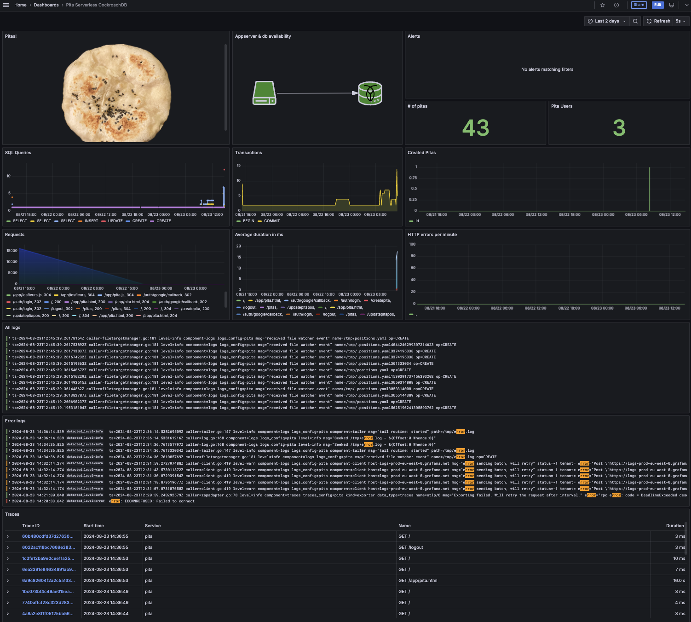

---

To be able to query your CockroachDB instance in Grafana dashboards you need to create a new datasource. The postgres one will just do fine because of the super high compatibility between CockroachDB and Postgres. 

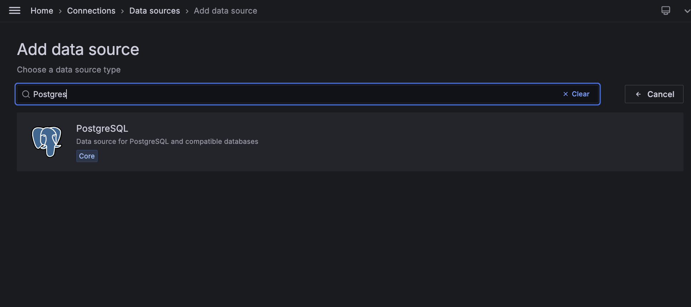

---

Fill in your Cockroach Cloud instance details (host URL, database name, username and password). You don't need to provide certificates, just leave as it is but don't forget to add the port to the host URL (e.g. hfkjhe-72487.8nj.gcp-europe-west1.cockroachlabs.cloud:26257). Postgres' default port 5432 is different from CockroachDB's 26257. 

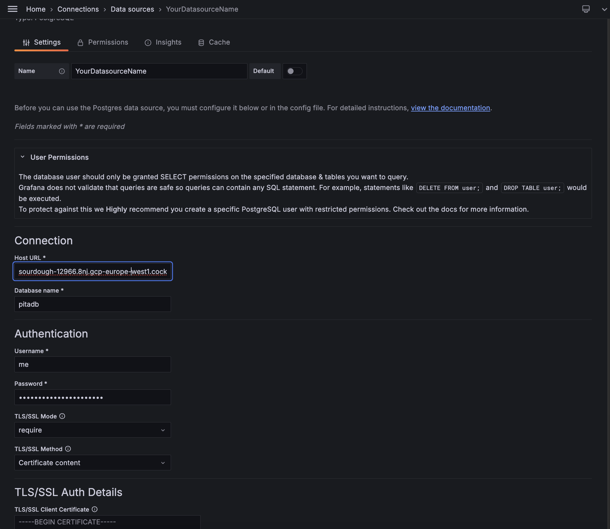

---

Hope this is a help when you build your next lightly used high available app with ci/cd and o11y for free!